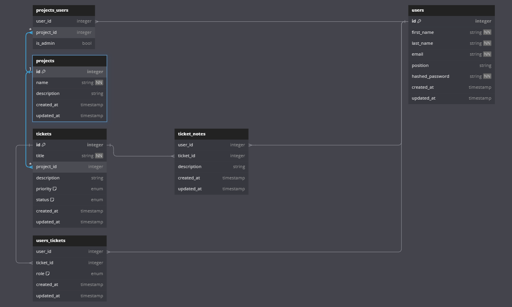

# Flask React Project

This is the starter for the Flask React project.

## Features
Projects (CRUD)
 - Users can create, view, edit, and delete projects.
 - Non-creating users must be invited with the url provided by clicking 'add user' on the Project page.
Tickets (CRU)
 - Users can create, view, edit, and archive tickets.
 - Archiving a Ticket changes the status but does not delete the ticket.
 - Tickets can be viewed on the Project page.
Ticket Notes (CRD)
  - Users can create, view, and delete notes on tickets.
  - Ticket Notes can be viewed on the Ticket page.
